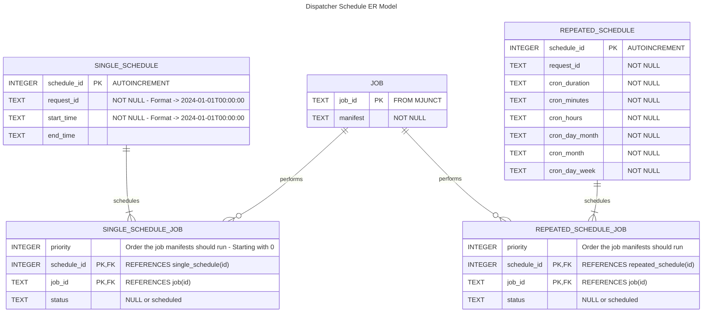

# Dispatcher Schedule Database Design

## Overview

The database to be used will be SQLite3.  The database will be used to keep track of scheduled tasks as either a single task at a specified time or a repeated task set up as a cron job.  

The goal of this design is to have a database design that adheres to the principles of Normal Form.

## ER Model

## DB Table Examples

### JOB Table

| id | manifest |
| :---- | :----- |
| swupd-fc276d74-014f-44c2-a57c-de1944a6e974 | valid Inband Manageability XML manifest - SOTA download only |
| swupd-09273593-ff7b-433f-820c-86440b6f8cf3 | valid Inband Manageability XML manifest - SOTA install only|
| setpwr-70ab8502-2c53-4417-ae57-90e4c2b7f0b6 | valid Inband Manageability XML manifest - Reboot system |
| fwupd-718814f3-b12a-432e-ac38-093e8dcb4bd1 | valid Inband Manageability XML manifest - FOTA |
| setpwr-d8be8ae4-7512-43c0-9bdd-9a066de17322 | valid Inband Manageability XML manifest - Reboot system |

### SINGLE_SCHEDULE Table

| id | request_id | start_time | end_time |
| :---- | :---- | :---- | :---- |
| 1  | 123 | 2024-04-01T08:00:00 | 2024-04-01T12:00:00 |
| 2  | 123 | 2024-05-01T08:00:00 | 2024-05-01T12:00:00|
| 3  | 234 | 2024-04-02T08:00:00 | 2024-04-02T14:00:00|

### REPEATED_SCHEDULE Table

NOTE: These values may not make sense in the real world.  Just for demonstration purposes.

| id | request_id | cron_duration | cron_minutes | cron_hours | cron_day_month | cron_month |cron_day_week |
| :---- | :---- | :---- | :---- | :---- | :---- | :---- | :---- |
| 1 | 123 | P1D | 0 | */3 | * | * | * |
| 2 | 123 | P7D | 0 | */6 | * | * | * |
| 3 | 234 | P2D | 0 | */8 | * | * | * |
| 4 | 234 | P14D | 0 | * | * | * | * |

### SINGLE_SCHEDULE_JOB Table

Example: To do a download, install, and reboot of SOTA at the time in schedule 1

| priority | schedule_id | job_id | status |
| :---- | :---- | :---- | :----- |
| 0   | 1 | swupd-fc276d74-014f-44c2-a57c-de1944a6e974| scheduled |
| 1   | 1 | swupd-09273593-ff7b-433f-820c-86440b6f8cf3 | scheduled |
| 2   | 1 | setpwr-70ab8502-2c53-4417-ae57-90e4c2b7f0b6 |   |

### REPEATED_SCHEDULE_JOB Table

Example: To do a download, install, and reboot of SOTA at the repeated time in schedule 2

| priority | schedule_id | job_id | status |
| :---- | :---- | :---- | :----- |
| 0   | 2 | fwupd-718814f3-b12a-432e-ac38-093e8dcb4bd1 | scheduled |
| 1   | 2 | setpwr-d8be8ae4-7512-43c0-9bdd-9a066de17322 | scheduled |

## Field Descriptions

| Name  | Description | Required? |
| :--- | :--- | :---|
| cron_duration |  period between successive executions of a scheduled task defined by a cron job | Yes |
| cron_minutes | field in a cron job schedule that specifies the minute of the hour at which the task should run, ranging from 0 to 59  | Yes |
| cron_hours | field in a cron job schedule that specifies the hour of the day at which the task should execute, using a 24-hour format ranging from 0 to 23 | Yes |
| cron_day_month | field in a cron job schedule that specifies the day of the month on which the task should run, ranging from 1 to 31.   | Yes  |
| cron_month |  field in a cron job schedule that specifies the month during which the task should execute, ranging from 1 (January) to 12 (December).   | Yes |
| cron_day_week | field in a cron job schedule that specifies the day of the week on which the task should run, ranging from 0 (Sunday) to 6 (Saturday).     | Yes |
| end_time | ending date/time for a single scheduled request. | No |
| id    | Auto-generated by DB.  The request Ids will not be unique in the tables to use as a PK. | Yes |
| manifest | valid Inband Manageability manifest | Yes |
| request_id | Request ID generated by MJunct that is used to trace the request.| Yes |
| start_time | starting date/time for a single scheduled request.| Yes |
| status | indicates if the request has been scheduled.  Not scheduled unless 'scheduled' is indicated in the field.  This is used to ensure the same manifest is not ran after a reboot | No |
