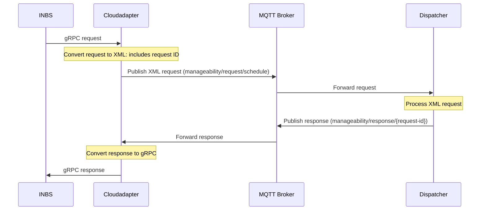

# INBS->Turtle Creek Schedule Flow

## Flow diagram

## High-Level Summary
This document outlines the process of handling schedule requests and responses between the Cloudadapter Agent, Dispatcher Agent, and INBS (In-Band Service, part of UDM). The flow involves:
1. Cloudadapter receiving a gRPC request from INBS
2. Cloudadapter converting the request to XML format
3. Cloudadapter publishing the XML request to Dispatcher via MQTT on topic 'manageability/request/schedule'
4. Dispatcher processing the XML request received via subscription to 'manageability/request/#'
5. Dispatcher sending a response (acknowledgement or error) on topic 'manageability/response/{request-id}'
6. Cloudadapter receiving the response on 'manageability/request/{request-id}'
7. Cloudadapter relaying the response back to INBS as gRPC

Key points:
- The schedule request is converted to XML format for communication between Cloudadapter and Dispatcher
- MQTT topics used:
  - For request: 'manageability/request/schedule'
  - For response: 'manageability/response/{request-id}'
- The request ID is encoded in the XML payload

## In Cloudadapter Agent

### InbsCloudClient >> _handle_inbm_command_request:
* Processes Schedule gRPC from INBS 
* Converts to XML format for Dispatcher
* Calls `publish_and_wait_response` (indirectly, via methods table); passing in:
  - topic: 'manageability/request/schedule'
  - response_topic: 'manageability/request/{request-id}'
  - payload: XML for dispatcher
  - timeout_seconds: 3

### MQTT >> publish_and_wait_response
* Sets up a threading Event to keep track of when response is received from Dispatcher
* Subscribes to the response topic 'manageability/request/{request-id}' with a callback that has the threading Event
* Publishes the request (which includes a request ID encoded in the XML) to 'manageability/request/schedule'
* Waits for the Event to be triggered or for timeout

## In Dispatcher Agent

### Dispatcher >> _on_cloud_request
* Is subscribed to 'manageability/request/#', so receives the schedule XML message on 'manageability/request/schedule'
* It parses the request into:
  - request_type: 'schedule'
  - request_id: None
* Then it puts request_type 'schedule', the XML schedule manifest, and the request_id None into a tuple
* Tuple gets inserted into Dispatcher's update_queue
* Dispatcher main thread sees a new item in the queue and spawns a thread calling handle_updates

### Dispatcher >> handle_updates
* Gets the item from the queue
* Pulls request_type 'schedule' and the XML schedule manifest from the item it retrieved
* Does some schedule handling
* Sends result or error back via _send_result, along with the request_id it retrieved from the schedule manifest

### Dispatcher >> _send_result
* Calls DispatcherBorker >> send_result

### DispatcherBroker >> send_result
* Sees that it has both a message and a request ID to send
* Publishes response message (which is an acknowledgement or an error) on topic 'manageability/response/{request_id}'

## Back In Cloudadapter Agent

### MQTT >> publish_and_wait_response
* Receives message from Dispatcher (or times out); raises TimeoutError on timeout, or returns response (normally just acknowledgement)

### InbsCloudClient >> _handle_inbm_cloud_request:
* Receives response or exception from publish_and_wait_response, and sends back to INBS as gRPC