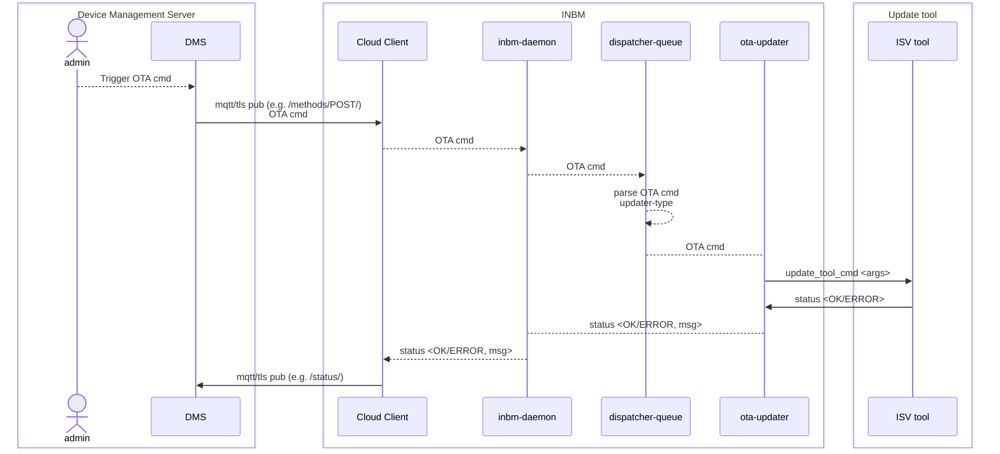
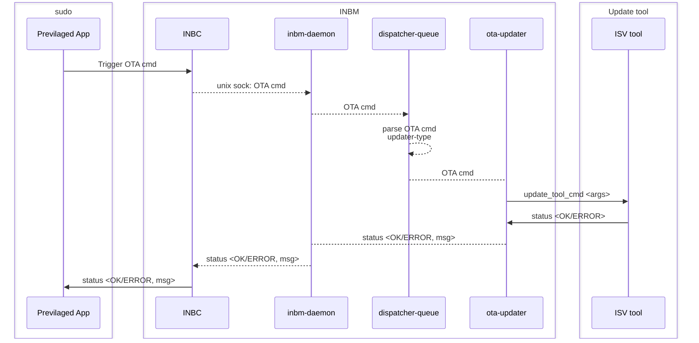
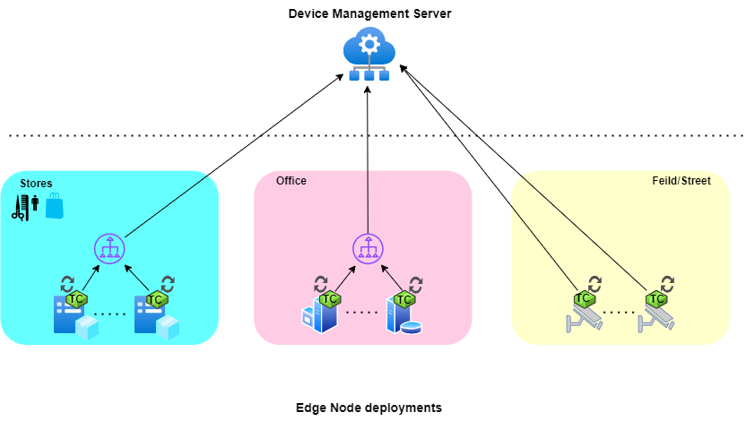

# In-band Manageability 5.0: Architecture

## Overview

In-band Manageability 5.0 (a.k.a. INBMv5, Turtle Creek v5) is a reimplementation of INBM in Golang.

### Motivation

`Re-architecting` and `Re-implementing` INBM is a major undertaking which was driven by the below listed motivation points:

1. **Reduce complexity**: INBM primarily being a solution which is self-contained on a single compute device (Edge Node, IOT device etc.) was not leveraging `micro-services` architecture's inherent advantages but instead introduced additional complexity of managing and securing the services and their communication channels. With the re-architecture we plan on bringing all the `business-logic` of various agent within a single application/service thereby reducing complexity.
1. **Improve performance**: Re-implementation of INBM will be done in `Golang` which is inherently better in performance w.r.t. Python being a compiled language as compared to interpreted.
1. **Reduce footprint**: With all the functionality being brought into a single application the binary footprint overhead introduced by including common dependencies and Python interpreter in each agent will be removed.
1. **Improve security and scalability**: Golang's characteristics of `statically typed`, `concurrency` and `memory management` helps building a more secure and optimized application.

### Backward compatibility and features

Like the earlier releases, the intension is to have as minimal an impact as possible for external consumers of INBM. This `backwards compatibility` requirement for INBMv5 insures that

- the primary OTA feature set that INBM provided remain the same i.e.:
  - OS Update
  - Firmware Update
  - Application update
  - Basic telemetry and events reporting

- the primary `device-management` interfaces used and provided by INBM remain the same i.e.:
  - `inbc`, command-line interface for local usage
  - Azure IOT Central connectivity for `CSP` enablement
  - ThingsBoard connectivity for `on-premise` device management

> **NOTE** The availability of these features shall be staged in multiple releases starting with INBM v5.0

## Architecture Diagram

Below is a high-level architecture diagram for INBMv5 leveraging Golang's `multi-threading` capability and `channel` based inter-thread communication.


   Figure 1: INBMv5 High-Level Architecture

### Key Components

1. #### inbm-daemon

   - **Function**: Main manageability application which runs in the background
   - **Main Tasks**:
      - Spawns other `persistant` or `long-living` threads like `cloud-client`, `dispatcher-queue` and `telemetry-reporter`.
      - Acts as a server and accepts incoming requests from `inbc` and `cloud-connect` over unix socket and pushes the over-the-air update commands to dispatcher-queue.

1. #### inbc

   - **Function**: In-band manageability's commandline interface
   - **Main Tasks**:
      - `inbc` acts as the commandline interace to other `previlaged` user-space applications to perform device-management actions (like os updates or firmware update etc) on the underlying host.
      - a `trusted client` application which communicates with `inbm-daemon` over unix-sockets, translating manageability commands into gRPC API calls.
   - **Example Use**:

      ```code
        inbc sota {--uri, -u=URI} 
        [--releasedate, -r RELEASE_DATE; default="2026-12-31"] 
        [--username, -un USERNAME]
        [--mode, -m MODE; default="full", choices=["full","no-download", "download-only"] ]
        [--reboot, -rb; default=yes]
        [--package-list, -p=PACKAGES]
      ```

    For detailed usage of `inbc` refer to 

1. #### cloud-client

   - **Function**: Cloud `device management service` (DMS) connecting thread
   - **Main Tasks**:
      - North-bound acts MQTT client connecting to DMS (e.g. Azure IOT Central or ThingsBoard)
      - South-bound acts as `inbm-daemon` client translating over-the-air (ota) commands from DMS to `inbm-daemon` gRPC API's
      - Checks on any `state` file to perform additional tasks on startup, e.g. post a OS update related bootup.

1. #### dispatcher-queue

   - **Function**: Management command queue
   - **Main Tasks**:
      - implements a simple queue of size `1` for device management commands
      - invokes `updater` thread based on the type of update command e.g. firmware or os or application

1. #### updater threads

   - **Function**: A `transieant` thread performing update on underlying host
   - **Main Tasks**:
      - _Firmware updater_: Perfomrs firmware update related tasks like:
         - check applicability, i.e. verdor, version and date checks
         - download capsule file and perform signature checks if applicable
         - invoke IBV's firmware update tool based on firmware-update config file look up.
         - update logging and state files
         - send intermediate results to `inbm-daemon` for reporting
         - trigger reboot of platform if applicable
      - _OS updater_: Perfomrs OS update related tasks like:
         - check applicability, e.g. checks available disk space
         - download OS image file and perform signature checks if applicable
         - invoke OS update tool based on underlying OS type/distribution.
         - update logging and state files
         - send intermediate results to `inbm-daemon` for reporting
         - trigger reboot of platform if applicable
      - _Application updater_: Perfomrs application update related tasks like:
         - check applicability, e.g. checks available disk space
         - invoke underlying OS distributions `package manager` to perfomr the required installation tasks.
         - update logging and state files
         - send results to `inbm-daemon` for reporting

1. #### telemerty-reporter

   - **Function**: Thread performing basic platform telemetry collection and reporting
   - **Main Tasks**: Basic plaform telemetry being collected by `telemetry-reporter` can be catogarized as `static` and `dynamic`
      - _Static_: Information that remains same for the most part of the a devices life cycle (e.g. UUID, Serial number etc) or only changes on updates (e.g. Firmware version, OS version etc)
      - _Dynamic_: Information which constantly changes and is ideal to be plotted on a `time-sereis` database (e.g. CPU usage, memory usage etc)

## Data Flow

INBM on Edge Node can be used in two modes:

1. _cloud-connect_: when INBM is provisioned to connect to a `DMS` and receives update related `ota`commands from cloud.
1. _local-host_: when INBM is provisioned to be only invoked by a `privilaged` user-space application running on the same host OS.

Described below are the different data flow paths based on the provisioning modes for commands and information:

### Cloud-connect data flow



### local-host data flow



## Extensibility and Integration

Extensibility in INBM's context can be defined by providing hooks in place to extend support:

- connecting to a new device management server (dms), e.g. Amazon or Googles device management solutions
  - this would involve adding new adapter in `cloud-client` which adhears to the protocol supported by the dms.

- executing new OTA cmd type, to enable a customer's specific usecase for e.g. install drivers or run specific applications
  - adding a new OTA cmd typically will involve adding new handlers in:
    - `cloud-client` - additional handler for the new cmd
    - `inbm-daemon` - additional logic to spawn a new type of ota thread
    - `new-thread` - buisness logic executing the new cmd and reporting result

- sending additional telemetry from device, e.g. GPU utilization
  - add data collection routin in `telemerty-reporter`
  - add `key:value` pairs for the new telemetry data getting collected
  - possible update in `cloud-client` to send this data to `dms`

## Deployment

INBM shall be deployed as a `native` or `bare-metal-agent` OS application on the Edge Node with `root` privileges.

## Implementation

Definition of done for all stories (once integration test is ready) -must- include 80% unit test coverage and 
at least one happy and one failure path per major feature. Can reuse Turtle Creek v4 integration tests if needed.

Starting epics/stories:

### Epic 1: Foundation & Skeleton
**Goal:** Provide a “walking skeleton” with code structure, basic installers, a daemon, CLI tool, UNIX socket communication, a provision-tc skeleton, and automated CI/CD.

- **Story 1.1:** Repository & Branch Setup  
  - Properly structured repository and branching strategy  
  - Repo structured, branch conventions defined, README included. Decide on branch name for INBM v5.

- **Story 1.2:** Installer/Uninstaller & .deb Package  
  - Install/uninstall Turtle Creek daemon and inbc CLI using .deb packages  
  - *single* .deb package created, installer shell script works, uninstall shell script works.

- **Story 1.3:** Turtle Creek Daemon as a systemd Service  
  - Turtle Creek daemon to run automatically on system boot  
  - systemd service file created, daemon auto-starts, logs configured.

- **Story 1.4:** inbc <-> Daemon Communication via UNIX Socket  
  - inbc CLI communicates with the Turtle Creek daemon through a UNIX socket  
  - UNIX socket communication established, error handling for invalid commands.

- **Story 1.5:** provision-tc Skeleton & Service Enablement  
  - Run a `provision-tc` command that enables and starts the Turtle Creek daemon  
  - `provision-tc` script/command enabling daemon, logging actions. Maintain compatibility with Turtle Creek v4.

- **Story 1.6:** CI/CD Setup with Scans & Integration Tests  
  - Automated builds/tests to run in Jenkins with security scans  
  - Jenkins pipeline configured, scanning tools integrated, basic integration test set up.

### Epic 2: Security
**Goal:** Implement foundational security features such as TPM/LUKS for startup, AppArmor profile, and SELinux for Tiber.

- **Story 2.1:** TPM/LUKS Setup (Reuse v4 Scripts)  
  - System uses TPM/LUKS encryption at startup  
  - TPM/LUKS scripts integrated: can borrow from Turtle Creek v4; use same scheme/directory layout.

- **Story 2.2:** AppArmor Profile  
  - AppArmor profile for the Turtle Creek daemon  
  - AppArmor profile enforced when Turtle Creek is installed

### Epic 3: Basic SOTA
**Goal:** Implement basic SOTA updates for Ubuntu and Tiber, with optional rollback/health checks.

- **Story 3.1:** Ubuntu SOTA Without Rollback/Health Check  
  - Deploy SOTA updates via inbc without rollback or health checks  
  - Manifest format defined, update applied, success/failure logged.

- **Story 3.2:** Ubuntu SOTA with Rollback/Health Check  
  - Rollback/health checks on system reboot  
  - Health-check implemented, rollback logic added, reboot scenarios tested.

- **Story 3.3:** Tiber A/B Updates Initially  
  - Deploy A/B updates  
  - Download, update, and rollback on failure should function properly (use Turtle Creek v4 as reference).

### Epic 4: Clouds
**Goal:** Connect to cloud backends (Azure or INBS/UDM) for SOTA updates, configured via `adapter.cfg`.

- **Story 4.1:** Azure SOTA via Manifest  
  - System connects to Azure for SOTA using a manifest  
  - Connect to Azure working; Turtle Creek logs events to Azure; Turtle Creek responds to SOTA manifest properly and reconnects on reboot  

- **Story 4.2:** INBS/UDM SOTA via gRPC  
  - System connects to INBS/UDM over gRPC  
  - `adapter.cfg` for INBS, Turtle Creek should respond to pings and to SOTA requests; only need to support 'immediate' requests (no scheduling needed); should send job status when done.

### Epic 5: Telemetry
**Goal:** Enable telemetry for Azure or UDM, initially static data followed by dynamic data.

- **Story 5.1:** Static Telemetry to Azure  
  - Send predefined static telemetry to Azure  
  - Implement all static telemetry supported in Turtle Creek v4; send on startup (once connected to Azure)

- **Story 5.2:** Dynamic Telemetry to Azure  
  - Send dynamic telemetry to Azure  
  - Implement all dynamic telemetry supported in Turtle Creek v4; send periodically

## System Diagram

Below represents a wholistic view of how Turtle Creek (TC) fits into a Device Management system.

As depicted in the below diagram, TC is a `self-contained` Edge Node component which works in conjunction with a `DMS` to enable a `Day 2` device management task or usecase, e.g. software update.

TC, when provisioned to connect to a DMS, shall `reach out` to the server based on the protocol that DMS supports (e.g. MQTT).

Also depicted in the diagram are different Edge Node types on which TC can be installed on, as well as the location of the Edge Nodes covering cases when the nodes are behind a company firewall/proxy gateway as well as on field with direct internet connectivity.



## Security implications

Security is paramount for any and all software solution and in INBM's case the stakes are even higher as the use-case involves updating components (OS, application, firmware) on the Edge Node.

The change in architecture in INBM v5 is designed to inherently bring in security advantages and reduces complexity. While some of the advantages comes in from the chosen language of implementation – Go, e.g. static-typing, binary-compilation etc, other are achieved by purposeful design changes as outlined below:

- Single (monolithic) service: moving away from `micro-services` to `single-service`. Moving to a single service implementation removes the need of inter-services authentication, thus removing the requirement of generating, storing and access controlling of inter-process-communication credential.
- Unix-sockets:  Using unix sockets for ipc instead of mqtt pub/sub removes the inherent requirement of managing and securing mqtt-broker and maintaining an ACL.

> **IMPORTANT NOTE** The security requirements and measures to ensure secure communication between `DMS` and INBM's `cloud-client` remains unchanged.</br>
Also security hardening mechanism like access control enforcement done via OS/kernel tool like `AppArmor` or `SELinux` are also still applicable and used in INBM v5

## Scalability

INBM being a self contained Edge Node software component with the requirement of having one instance of it running on the physical device does not have any specific design considerations for scalability.
