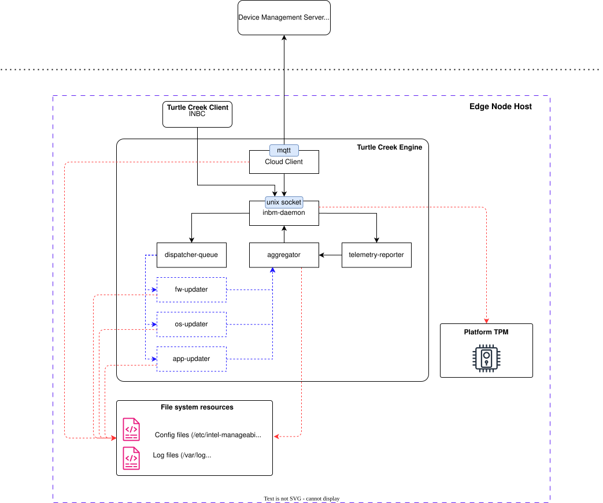
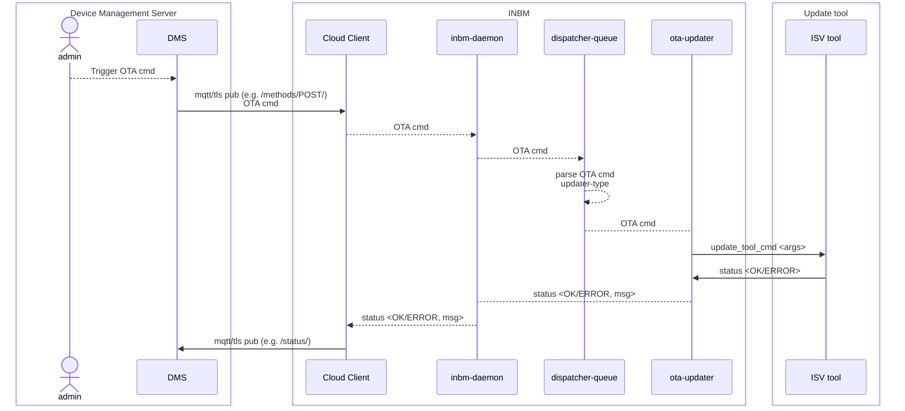
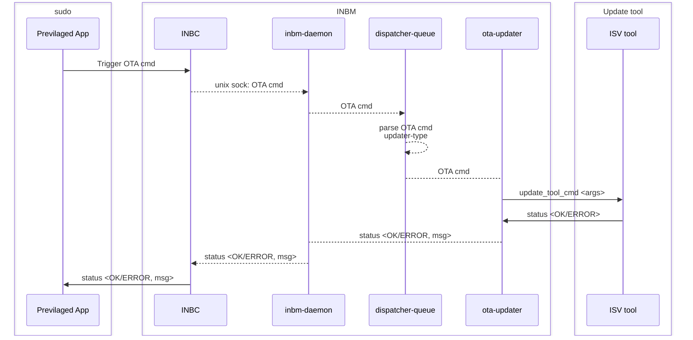

# In-band Manageability 5.0: Architecture

## Overview

In-band Manageability 5.0 (a.k.a. INBMv5) is a reimplementation of INBM in Golang.

### Motivation

`Re-architecting` and `Re-implementing` INBM is a major undertaking which was driven by the below listed motivation points:

1. **Reduce complexity**: INBM primarily being a solution which is self-contained on a single compute device (Edge Node, IOT device etc.) was not leveraging `micro-services` architecture's inherent advantages but instead introduced additional complexity of managing and securing the services and their communication channels. With the re-architecture we plan on bringing all the `business-logic` of various agent within a single application/service thereby reducing complexity. 
1. **Improve performance**: Re-implementation of INBM will be done in `Golang` which is inherently better in performance w.r.t. Python being a compiled language as compared to interpreted.
1. **Reduce footprint**: With all the functionality being brought into a single application the binary footprint overhead introduced by including common dependencies and Python interpreter in each agent will be removed.
1. **Improve security and scalability**: Golang's characteristics of `statically typed`, `concurrency` and `memory management` helps building a more secure and optimized application. 

### Backward compatibility and features

Like the earlier releases, the intension is to have as minimal an impact as possible for external consumers of INBM. This `backwards compatibility` requirement for INBMv5 insures that

- the primary OTA feature set that INBM provided remain the same i.e.:
  - OS Update
  - Firmware Update
  - Application update
  - Basic telemetry and events reporting

- the primary `device-management` interfaces used and provided by INBM remain the same i.e.:
  - `inbc`, command-line interface for local usage
  - Azure IOT Central connectivity for `CSP` enablement
  - ThingsBoard connectivity for `on-premise` device management

> **NOTE** The availability of these features shall be staged in multiple releases starting with INBM v5.0

## Architecture Diagram

Below is a high-level architecture diagram for INBMv5 leveraging Golang's `multi-threading` capability and `channel` based inter-thread communication.



   Figure 1: INBMv5 High-Level Architecture

### Key Components

1. #### inbm-daemon

   - **Function**: Main manageability application which runs in the background
   - **Main Tasks**:
      - Spawns other `persistant` or `long-living` threads like `cloud-client`, `dispatcher-queue` and `telemetry-reporter`.
      - Acts as a server and accepts incoming requests from `inbc` and `cloud-connect` over unix socket and pushes the over-the-air update commands to dispatcher-queue. 

1. #### inbc

   - **Function**: In-band manageability's commandline interface
   - **Main Tasks**:
      - `inbc` acts as the commandline interace to other `previlaged` user-space applications to perform device-management actions (like os updates or firmware update etc) on the underlying host.
      - a `trusted client` application which communicates with `inbm-daemon` over unix-sockets, translating manageability commands into gRPC API calls.
   - **Example Use**:

      ```code
        inbc sota {--uri, -u=URI} 
        [--releasedate, -r RELEASE_DATE; default="2026-12-31"] 
        [--username, -un USERNAME]
        [--mode, -m MODE; default="full", choices=["full","no-download", "download-only"] ]
        [--reboot, -rb; default=yes]
        [--package-list, -p=PACKAGES]
      ```

    For detailed usage of `inbc` refer to 

1. #### cloud-client

   - **Function**: Cloud `device management service` (DMS) connecting thread
   - **Main Tasks**:
      - North-bound acts MQTT client connecting to DMS (e.g. Azure IOT Central or ThingsBoard)
      - South-bound acts as `inbm-daemon` client translating over-the-air (ota) commands from DMS to `inbm-daemon` gRPC API's
      - Checks on any `state` file to perform additional tasks on startup, e.g. post a OS update related bootup.

1. #### dispatcher-queue

   - **Function**: Management command queue
   - **Main Tasks**:
      - implements a simple queue of size `1` for device management commands
      - invokes `updater` thread based on the type of update command e.g. firmware or os or application

1. #### updater threads

   - **Function**: A `transieant` thread performing update on underlying host
   - **Main Tasks**:
      - _Firmware updater_: Perfomrs firmware update related tasks like:
         - check applicability, i.e. verdor, version and date checks
         - download capsule file and perform signature checks if applicable
         - invoke IBV's firmware update tool based on firmware-update config file look up.
         - update logging and state files
         - send intermediate results to `inbm-daemon` for reporting
         - trigger reboot of platform if applicable
      - _OS updater_: Perfomrs OS update related tasks like:
         - check applicability, e.g. checks available disk space
         - download OS image file and perform signature checks if applicable
         - invoke OS update tool based on underlying OS type/distribution.
         - update logging and state files
         - send intermediate results to `inbm-daemon` for reporting
         - trigger reboot of platform if applicable
      - _Application updater_: Perfomrs application update related tasks like:
         - check applicability, e.g. checks available disk space
         - invoke underlying OS distributions `package manager` to perfomr the required installation tasks.
         - update logging and state files
         - send results to `inbm-daemon` for reporting

1. #### telemerty-reporter

   - **Function**: Thread performing basic platform telemetry collection and reporting
   - **Main Tasks**: Basic plaform telemetry being collected by `telemetry-reporter` can be catogarized as `static` and `dynamic`
      - _Static_: Information that remains same for the most part of the a devices life cycle (e.g. UUID, Serial number etc) or only changes on updates (e.g. Firmware version, OS version etc)
      - _Dynamic_: Information which constantly changes and is ideal to be plotted on a `time-sereis` database (e.g. CPU usage, memory usage etc)

## Data Flow

INBM on Edge Node can be used in two modes:

1. _cloud-connect_: when INBM is provisioned to connect to a `DMS` and receives update related `ota`commands from cloud.
1. _local-host_: when INBM is provisioned to be only invoked by a `privilaged` user-space application running on the same host OS.

Described below are the different data flow paths based on the provisioning modes for commands and information:

### Cloud-connect data flow



### local-host data flow



## Extensibility

Extensibility in INBM's context can be defined by providing hooks in place to extend support:

- connecting to a new device management server (dms), e.g. Amazon or Googles device management solutions
  - this would involve adding new adapter in `cloud-client` which adhears to the protocol supported by the dms.

- executing new OTA cmd type, to enable a customer's specific usecase for e.g. install drivers or run specific applications
  - adding a new OTA cmd typically will involve adding new handlers in:
    - `cloud-client` - additional handler for the new cmd
    - `inbm-daemon` - additional logic to spawn a new type of ota thread
    - `new-thread` - buisness logic executing the new cmd and reporting result

- sending additional telemetry from device, e.g. GPU utilization
  - add data collection routin in `telemerty-reporter`
  - add `key:value` pairs for the new telemetry data getting collected
  - possible update in `cloud-client` to send this data to `dms`

## Deployment

[Content of Deployment]


Technology Stack
----------------

Implementation
~~~~~~~~~~~~~~

Here are some preliminary phases for initial implementation:

Foundation/skeleton
* Repo branch set up
* installer/uninstaller working
* .debs available
* SPEC in TiberOS branch for .rpms
* Turtle creek daemon running as systemd service
* inbc able to talk to turtle creek daemon via UNIX socket
* CI/CD and scans working
* integration test in place
* `provision-tc` skeleton that enables and starts service

Security
* TPM/LUKS set up so that it is available for Turtle Creek daemon on startup
* apparmor profile in place and enforced
* selinux for Tiber

Basic SOTA
* INBC SOTA working on Ubuntu (no rollback/health check); with correct manifest format
* INBC SOTA working on Ubuntu with rollback/health check on reboot
* INBC SOTA working on Tiber A/B--download+update initially

Clouds
* Able to connect to Azure and handle SOTA via manifest
* Able to connect to INBS/UDM and handle SOTA via gRPC

Telemetry
* Detect and send telemetry to Azure--static
* Detect and send telemetry to Azure--dynamic
* ..any telemetry features required by UDM


## System Diagram

Guidelines:

   1. Include a diagram to illustrate how the system is deployed and what other applications it may be connected to.
   2. Clearly label components, workflows, and integration points.

.. figure:: ./images/stack-diagram.png
   :alt: Technology Stack of [System or Tool Name]

   Figure 1: Technology Stack of [System or Tool Name]

## Integrations

Guidelines:

   1. List the integrations between this application and other tech stack applications or systems.
   2. Include links to additional material if available, including the development project, code, diagrams, and issues.

[Content of Integrations]

## Security

Guidelines:

   1. Provide a brief overview of the security measures in place.
   2. Explain the importance of security for the project.

### Security Policies

Guidelines:

   1. Describe the security policies in place.
   2. Include information on data protection, user privacy, and compliance.

[Content of security policies]

### Authentication

Guidelines:

   1. Explain the authentication mechanisms used.
   2. Include information on password policies, multi-factor authentication, and session management.

[Content of Authentication]

### Access Control

Guidelines:

   1. Describe the access control mechanisms in place.
   2. Include information on role-based access control (RBAC), permissions, and user roles.

[Content of Access Control]

### Auditing

Guidelines:

   1. Explain the auditing mechanisms in place.
   2. Include information on logging, monitoring, and audit trails.

[Content of Auditing]

## Scalability

Guidelines:

   1. Provide a brief overview of the scalability considerations.
   2. Explain the importance of scalability for the project.

## Supporting Resources

Guidelines:

   1. Provide links to related documentation or tools.
   2. Include troubleshooting guides and community resources.

- `API Guide <./APIs.rst>`_
- `User Guide <./User.rst>`_

Appendix
--------

Appendix A: [Title of Appendix A]
~~~~~~~~~

.. 
   Guidelines:
   1. Provide a brief introduction or description of the appendix content.
   2. Include any relevant details, data, or supplementary information.

[Content of Appendix A]

Appendix B: [Title of Appendix B]
~~~~~~~~~

.. 
   Guidelines:
   1. Provide a brief introduction or description of the appendix content.
   2. Include any relevant details, data, or supplementary information.

[Content of Appendix B]

Appendix C: [Title of Appendix C]
~~~~~~~~~

.. 
   Guidelines:
   1. Provide a brief introduction or description of the appendix content.
   2. Include any relevant details, data, or supplementary information.

[Content of Appendix C]
